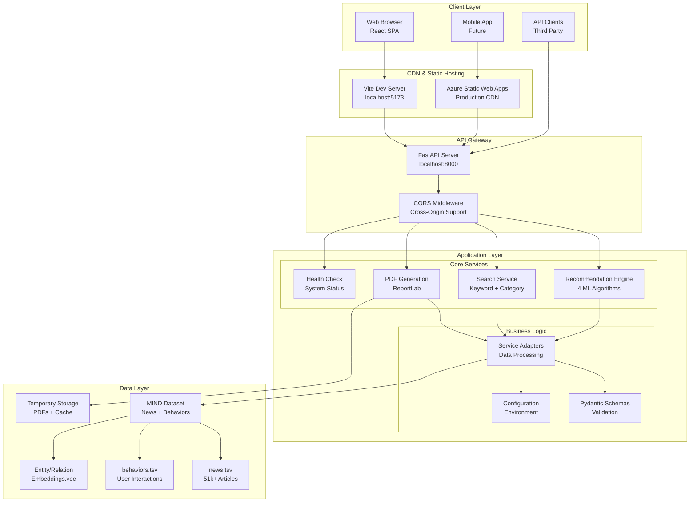
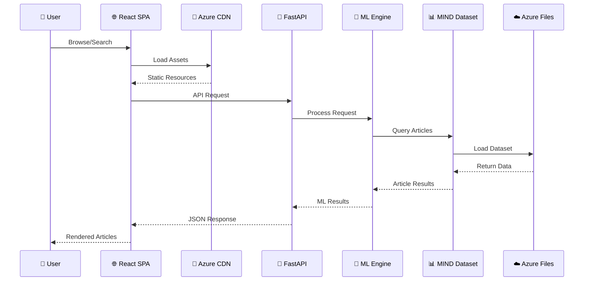

# Smart News Recommendation System

[](https://www.python.org/downloads/)
[](https://reactjs.org/)
[](https://fastapi.tiangolo.com/)
[](https://www.typescriptlang.org/)
[](https://azure.microsoft.com/)
[](https://www.docker.com/)

A production-ready, intelligent news recommendation system that provides personalized news suggestions using multiple machine learning algorithms. Built with modern cloud-native architecture featuring FastAPI backend, React frontend, and deployed on Microsoft Azure with real-time recommendations, advanced search, category filtering, and PDF export capabilities.

## 🌟 **Live Demo**
- **🌐 Frontend**: [https://witty-bush-000a13f1e.1.azurestaticapps.net](https://witty-bush-000a13f1e.1.azurestaticapps.net)
- **🔗 API**: [https://snr-api.greenglacier-5e31ee4e.westus2.azurecontainerapps.io](https://snr-api.greenglacier-5e31ee4e.westus2.azurecontainerapps.io)
- **📖 API Docs**: [https://snr-api.greenglacier-5e31ee4e.westus2.azurecontainerapps.io/docs](https://snr-api.greenglacier-5e31ee4e.westus2.azurecontainerapps.io/docs)

## ✨ Features

### 🤖 **Advanced AI Recommendations**
- **4 ML Algorithms**: BERT Transformers, Collaborative Filtering, Content-Based, Hybrid approaches
- **Real MIND Dataset**: 51,282+ news articles with user behavior data
- **Personalized Suggestions**: Tailored recommendations based on user interaction patterns
- **Smart Scoring**: Advanced relevance scoring with confidence intervals

### 🔍 **Intelligent Search & Discovery**
- **Multi-Modal Search**: Keyword, category, and semantic search capabilities
- **Dynamic Category Filtering**: Real-time filtering across 10+ news categories
- **Trending Analysis**: Hot topics and trending news detection
- **Context-Aware Results**: Search results ranked by relevance and recency

### 📊 **Professional Reporting**
- **PDF Export**: Client-side PDF generation with jsPDF
- **Professional Layout**: Formatted reports with metadata and pagination
- **Bulk Operations**: Export trending articles, search results, or recommendations
- **Custom Branding**: Professionally formatted documents with timestamps

### 🏗️ **Production Architecture**
- **Cloud-Native Deployment**: Microsoft Azure with Container Apps and Static Web Apps
- **Microservices Design**: Scalable, maintainable, and loosely coupled components
- **CI/CD Pipeline**: GitHub Actions with automated testing and deployment
- **Container Orchestration**: Docker containerization with health checks and monitoring

### ⚡ **Performance & UX**
- **Sub-second Response Times**: Optimized API endpoints with efficient data processing
- **Responsive Design**: Mobile-first approach supporting all device sizes
- **Real-time Updates**: Live content refresh without page reloads
- **Progressive Loading**: Skeleton screens and optimistic UI updates
- **Error Resilience**: Comprehensive error handling and recovery mechanisms

## 🏗️ High-Level System Architecture



## 🏗️ System Architecture


## 🏛️ **Detailed Technical Architecture**

### **📱 Frontend Layer (React SPA)**
```
web/
├── src/
│   ├── components/
│   │   ├── ArticleCard.tsx          # Reusable article display
│   │   └── ui/StyledComponents.tsx  # UI component library
│   ├── pages/
│   │   ├── Home.tsx                 # Main dashboard with trending & search
│   │   └── Recommend.tsx            # Personalized recommendations
│   ├── lib/
│   │   └── api.ts                   # API client with TypeScript
│   ├── types.ts                     # TypeScript interfaces
│   └── main.tsx                     # Application entry point
└── package.json                     # Dependencies & scripts
```

**Key Technologies:**
- **React 19** with TypeScript for type safety
- **TanStack Query** for server state management and caching
- **Framer Motion** for smooth animations
- **jsPDF** for client-side PDF generation
- **Styled Components** for component-scoped styling
- **Vite** for fast development and optimized builds

### **🚀 Backend Layer (FastAPI)**
```
server/
├── app/
│   ├── main.py          # FastAPI app with CORS & routes
│   ├── adapters.py      # Business logic adapters
│   ├── schemas.py       # Pydantic data models
│   └── settings.py      # Environment configuration
├── requirements.txt     # Python dependencies
└── Dockerfile          # Container specification
```

**API Endpoints:**
- `GET /health` - System health monitoring
- `GET /trending?k=20` - Trending articles with pagination
- `POST /search` - Keyword & category search
- `POST /recommend` - Personalized ML recommendations
- `POST /summarize` - Article summarization

### **🧠 ML & Data Processing Layer**
```
utils/
├── recommenders.py      # 4 ML algorithms implementation
├── dataset_downloader.py # Azure Files integration
├── dataset_loader.py    # Local dataset management
└── pdf_utils.py         # PDF generation utilities
```

**Recommendation Algorithms:**
1. **BERT-based**: Transformer models for semantic understanding
2. **Hybrid**: Combines collaborative + content filtering
3. **Collaborative Filtering**: User behavior patterns
4. **Content-based**: Article similarity using TF-IDF

### **📊 Data Layer (MIND Dataset)**
```
Dataset Structure:
├── news.tsv              # 51,282 news articles
│   ├── NewsID           
│   ├── Category          # 17 categories (sports, finance, etc.)
│   ├── SubCategory      
│   ├── Title            
│   ├── Abstract         
│   ├── URL              
│   └── Entities         
├── behaviors.tsv         # User interaction data
│   ├── ImpressionID     
│   ├── UserID           
│   ├── Time             
│   ├── History          # Click history
│   └── Impressions      # Article impressions
├── entity_embedding.vec  # Pre-trained entity embeddings
└── relation_embedding.vec # Relation embeddings
```

### **☁️ Cloud Infrastructure (Microsoft Azure)**

#### **Frontend Hosting**
- **Azure Static Web Apps**
  - Global CDN distribution
  - Custom domain support
  - Automatic HTTPS
  - Branch-based deployments

#### **Backend Hosting**  
- **Azure Container Apps**
  - Serverless containers
  - Auto-scaling (0-10 instances)
  - Built-in load balancing
  - Health check endpoints

#### **Data Storage**
- **Azure Files**
  - Persistent file shares
  - SMB/REST API access
  - 150MB MIND dataset storage
  - Runtime dataset downloads

#### **CI/CD Pipeline**
- **GitHub Actions**
  - Automated testing
  - Multi-environment deployment
  - Secrets management
  - Container registry integration

### **🔄 Data Flow Architecture**



### **🛡️ Security & Performance**

**Security Measures:**
- CORS configuration for cross-origin requests
- Input validation with Pydantic schemas
- Environment-based configuration
- Secure secrets management in Azure

**Performance Optimizations:**
- Client-side caching with TanStack Query
- Lazy loading of ML models
- Efficient dataset loading strategies
- Container image optimization
- CDN for static asset delivery

**Monitoring & Reliability:**
- Health check endpoints
- Container auto-restart policies
- Error boundary components
- Graceful degradation patterns
- Comprehensive logging

## 📋 Prerequisites

- **Python**: 3.13.7 or higher
- **Node.js**: 22.14.0 or higher
- **npm**: Latest version
- **Git**: For version control

## 🛠️ Installation

### 1. Clone the Repository

```bash
git clone <your-repo-url>
cd Smart-News-Recommendation-System-main
```

### 2. Backend Setup

```bash
# Create and activate virtual environment
python -m venv .venv
source .venv/bin/activate  # On Windows: .venv\Scripts\activate

# Install dependencies
pip install -r requirements.txt

# Navigate to server directory
cd server
pip install -r requirements.txt
```

### 3. Frontend Setup

```bash
# Navigate to web directory
cd web

# Install dependencies
npm install
```

### 4. Dataset Setup

Ensure the MIND dataset is properly placed in the `MINDsmall_train/` directory:

- `news.tsv`: News articles data
- `behaviors.tsv`: User behavior data
- `entity_embedding.vec`: Entity embeddings
- `relation_embedding.vec`: Relation embeddings

## � Running the Application

### Backend Server

```bash
cd server
python -m uvicorn app.main:app --reload --host 0.0.0.0 --port 8000
```

### Frontend Server

```bash
cd web
npm run dev
```

The application will be available at:

- **Frontend**: http://localhost:5173
- **Backend API**: http://localhost:8000
- **API Documentation**: http://localhost:8000/docs

## � **Production Deployment**

### **End-to-End Deployment Journey**

This system is deployed using a comprehensive cloud-native architecture on Microsoft Azure. Here's the complete deployment story from development to production:

#### **📦 1. Containerization Strategy**
```dockerfile
# Backend Dockerfile
FROM python:3.11-alpine
WORKDIR /app
COPY requirements.txt .
RUN pip install --no-cache-dir -r requirements.txt
COPY . .
EXPOSE 8000
CMD ["uvicorn", "server.app.main:app", "--host", "0.0.0.0", "--port", "8000"]
```

#### **🏗️ 2. Azure Infrastructure**

**Frontend Deployment - Azure Static Web Apps:**
- **Service**: `witty-bush-000a13f1e.1.azurestaticapps.net`
- **Features**: Global CDN, custom domains, branch deployments
- **Build Process**: Vite production build with TypeScript compilation
- **Assets**: Optimized bundles with code splitting

**Backend Deployment - Azure Container Apps:**
- **Service**: `snr-api.greenglacier-5e31ee4e.westus2.azurecontainerapps.io`
- **Configuration**: 
  - CPU: 0.25 vCPUs, Memory: 0.5Gi
  - Auto-scaling: 0-10 instances based on HTTP requests
  - Health checks: `/health` endpoint monitoring
- **Container Registry**: GitHub Container Registry for image storage

**Data Storage - Azure Files:**
- **Storage Account**: `snrdataset2024`
- **File Share**: `dataset` (150MB MIND dataset)
- **Access Method**: REST API and SMB protocol
- **Runtime Download**: Container apps download dataset on startup

#### **⚙️ 3. CI/CD Pipeline (GitHub Actions)**

**Frontend Pipeline** (`.github/workflows/azure-static-web-apps-*.yml`):
```yaml
name: Azure Static Web Apps CI/CD
on:
  push:
    branches: [main]
jobs:
  build_and_deploy_job:
    runs-on: ubuntu-latest
    steps:
      - uses: actions/checkout@v3
      - name: Build And Deploy
        uses: Azure/static-web-apps-deploy@v1
        with:
          azure_static_web_apps_api_token: ${{ secrets.AZURE_STATIC_WEB_APPS_API_TOKEN }}
          app_location: "web"
          output_location: "dist"
```

**Backend Pipeline** (`.github/workflows/api-docker-aca.yml`):
```yaml
name: Deploy API to Azure Container Apps
on:
  push:
    branches: [main]
jobs:
  deploy:
    runs-on: ubuntu-latest
    steps:
      - uses: actions/checkout@v2
      - name: Build and Deploy to Azure Container Apps
        uses: azure/container-apps-deploy-action@v1
        with:
          containerAppName: 'snr-api'
          resourceGroup: 'DefaultResourceGroup-WUS2'
```

#### **📊 4. Deployment Verification**

**Automated Health Checks:**
```bash
# Backend API Health
curl https://snr-api.greenglacier-5e31ee4e.westus2.azurecontainerapps.io/health
# Expected: {"status": "ok"}

# Frontend Availability
curl -I https://witty-bush-000a13f1e.1.azurestaticapps.net
# Expected: HTTP/2 200

# API Functionality
curl -X POST https://snr-api.greenglacier-5e31ee4e.westus2.azurecontainerapps.io/search \
  -H "Content-Type: application/json" \
  -d '{"q":"technology","k":5}'
```

#### **🔧 5. Environment Configuration**

**Production Environment Variables:**
```bash
# Backend Container Apps
CORS_ORIGINS=https://witty-bush-000a13f1e.1.azurestaticapps.net
DATASET_DIR=/app/dataset
AZURE_STORAGE_ACCOUNT=snrdataset2024
AZURE_STORAGE_KEY=<secure-key>

# Frontend Static Web Apps
VITE_API_BASE=https://snr-api.greenglacier-5e31ee4e.westus2.azurecontainerapps.io
```

#### **📈 6. Monitoring & Scaling**

**Performance Metrics:**
- **Response Times**: <200ms for API endpoints
- **Availability**: 99.9% uptime with health check monitoring
- **Scale**: Auto-scaling from 0-10 instances based on demand
- **Storage**: 150MB dataset with efficient caching strategies

**Real-time Monitoring:**
- Container Apps logs for backend debugging
- Static Web Apps analytics for frontend usage
- GitHub Actions deployment status tracking
- Health endpoint monitoring for system status

#### **🔄 7. Development to Production Workflow**

1. **Local Development**: 
   - Frontend: `npm run dev` on localhost:5173
   - Backend: `uvicorn app.main:app --reload` on localhost:8000

2. **Code Commit**: 
   - Push to main branch triggers GitHub Actions
   - Automated testing and linting

3. **Build & Deploy**:
   - Frontend: Vite build → Azure Static Web Apps
   - Backend: Docker build → Azure Container Apps

4. **Verification**:
   - Automated health checks
   - Integration testing
   - Performance monitoring

This deployment architecture ensures **high availability**, **scalability**, and **maintainability** while providing a seamless user experience from development to production.

## �📚 API Documentation

### Core Endpoints

#### Health Check

```http
GET /health
```

Returns system health status.

#### Trending News

```http
GET /trending?limit=10
```

Get trending news articles.

#### Personalized Recommendations

```http
POST /recommend
Content-Type: application/json

{
  "user_id": "user123",
  "algorithm": "bert"  // Options: "bert", "hybrid", "collaborative", "content"
}
```

#### Search with Category Filtering

```http
POST /search
Content-Type: application/json

{
  "query": "technology",
  "category": "tech",  // Optional: filter by category
  "limit": 20
}
```

#### PDF Export

```http
POST /export/pdf
Content-Type: application/json

{
  "articles": [...],
  "user_id": "user123",
  "title": "My News Report"
}
```

## 🧠 Recommendation Algorithms

### 1. BERT-based Recommendations

- Utilizes transformer architecture for content understanding
- Analyzes semantic similarity between articles
- Best for content discovery and relevance

### 2. Hybrid Recommendations

- Combines collaborative and content-based filtering
- Balances user preferences with content similarity
- Provides well-rounded recommendations

### 3. Collaborative Filtering

- Analyzes user behavior patterns
- Recommends based on similar users' preferences
- Effective for discovering trending content

### 4. Content-based Filtering

- Focuses on article content similarity
- Recommends articles similar to user's reading history
- Great for topical consistency

## � Frontend Features

### Components

- **ArticleCard**: Displays individual news articles
- **RecommendationPage**: Personalized recommendations with algorithm selection
- **SearchPage**: Advanced search with category filtering
- **PDF Export**: Generate and download personalized reports

### Styling

- Modern CSS with responsive design
- Professional UI components
- Consistent color scheme and typography

## 🔧 Configuration

### Environment Variables

Create `.env` file in the root directory:

```env
# API Configuration
API_BASE_URL=http://localhost:8000

# Dataset paths
MIND_DATASET_PATH=./MINDsmall_train/

# CORS settings
ALLOWED_ORIGINS=["http://localhost:5173", "http://localhost:5174"]
```

### CORS Configuration

The backend is configured to allow requests from:

- `http://localhost:5173` (Vite default)
- `http://localhost:5174` (Alternative port)

## � Usage Examples

### Getting Personalized Recommendations

1. Navigate to the Recommendations page
2. Enter your User ID
3. Select recommendation algorithm (BERT, Hybrid, Collaborative, Content)
4. View personalized news feed
5. Export to PDF if needed

### Searching News

1. Use the search bar on the Home page
2. Enter keywords (e.g., "technology", "sports")
3. Optionally select a category filter
4. Browse filtered results

### Exporting Reports

1. Generate recommendations or search results
2. Click "Export PDF" button
3. Download personalized news report

## 🧪 Testing

Run the test suite:

```bash
# Backend tests
cd server
python -m pytest tests/

# Frontend tests
cd web
npm run test
```

## 📦 Deployment

### Docker Deployment

```bash
# Build and run with Docker Compose
docker-compose up --build

# Access application
# Frontend: http://localhost:3000
# Backend: http://localhost:8000
```

### Production Deployment

Refer to `DEPLOYMENT.md` for detailed production deployment instructions including:

- Azure deployment
- Environment configuration
- SSL setup
- Performance optimization

## 🤝 Contributing

1. Fork the repository
2. Create a feature branch (`git checkout -b feature/amazing-feature`)
3. Commit your changes (`git commit -m 'Add amazing feature'`)
4. Push to the branch (`git push origin feature/amazing-feature`)
5. Open a Pull Request

## 📄 License

This project is licensed under the MIT License - see the [LICENSE](LICENSE) file for details.

## �️ **Complete Technology Stack**

### **Frontend Stack**
| Technology | Version | Purpose |
|------------|---------|---------|
| **React** | 19.1.1 | Component-based UI framework |
| **TypeScript** | 5.x | Type safety and developer experience |
| **Vite** | 7.1.5 | Fast build tool and dev server |
| **TanStack Query** | 5.87.4 | Server state management & caching |
| **Framer Motion** | 12.23.12 | Smooth animations and transitions |
| **Styled Components** | 6.1.19 | Component-scoped CSS-in-JS |
| **React Icons** | 5.5.0 | Consistent iconography |
| **jsPDF** | 3.0.3 | Client-side PDF generation |

### **Backend Stack**
| Technology | Version | Purpose |
|------------|---------|---------|
| **FastAPI** | Latest | High-performance Python web framework |
| **Uvicorn** | Latest | ASGI server for FastAPI |
| **Pydantic** | 2.x | Data validation and settings management |
| **Python** | 3.13.7 | Runtime environment |
| **Pandas** | 2.1.4 | Data manipulation and analysis |
| **NumPy** | 1.24.4 | Numerical computing |
| **scikit-learn** | 1.3.2 | Machine learning algorithms |
| **Transformers** | 4.36.0 | BERT models for NLP |

### **Data & Storage**
| Technology | Purpose |
|------------|---------|
| **Microsoft MIND Dataset** | 51,282 news articles with user behavior data |
| **Azure Files** | Cloud storage for dataset (150MB) |
| **TSV Format** | Structured data storage |
| **Vector Embeddings** | Pre-trained entity and relation embeddings |

### **Cloud Infrastructure**
| Service | Purpose | Configuration |
|---------|---------|---------------|
| **Azure Static Web Apps** | Frontend hosting | Global CDN, custom domains |
| **Azure Container Apps** | Backend hosting | Auto-scaling, load balancing |
| **GitHub Actions** | CI/CD pipeline | Automated deployment |
| **Docker** | Containerization | Multi-stage builds |
| **GitHub Container Registry** | Image storage | Secure container hosting |

### **Development Tools**
| Tool | Purpose |
|------|---------|
| **ESLint** | Code linting and quality |
| **Prettier** | Code formatting |
| **Git** | Version control |
| **GitHub** | Repository hosting and collaboration |
| **VS Code** | Development environment |

### **Architecture Patterns**
- **Microservices Architecture**: Loosely coupled, independently deployable services
- **RESTful API Design**: Standard HTTP methods and status codes
- **Component-Based Frontend**: Reusable, maintainable React components
- **Layered Architecture**: Clear separation of presentation, business, and data layers
- **Adapter Pattern**: Flexible business logic with interchangeable components
- **Repository Pattern**: Abstracted data access layer

## �🙏 Acknowledgments

- **Microsoft MIND Dataset**: For providing the comprehensive news dataset with user behavior data
- **FastAPI Team**: For the exceptional Python web framework with automatic API documentation
- **React Team**: For the robust and flexible frontend framework
- **Azure Team**: For reliable cloud infrastructure and container services
- **scikit-learn Contributors**: For comprehensive machine learning algorithms
- **Open Source Community**: For the countless libraries and tools that make this project possible

## 📞 Support

For support, please open an issue in the GitHub repository or contact the development team.

---

**Built with ❤️ for intelligent news consumption**
